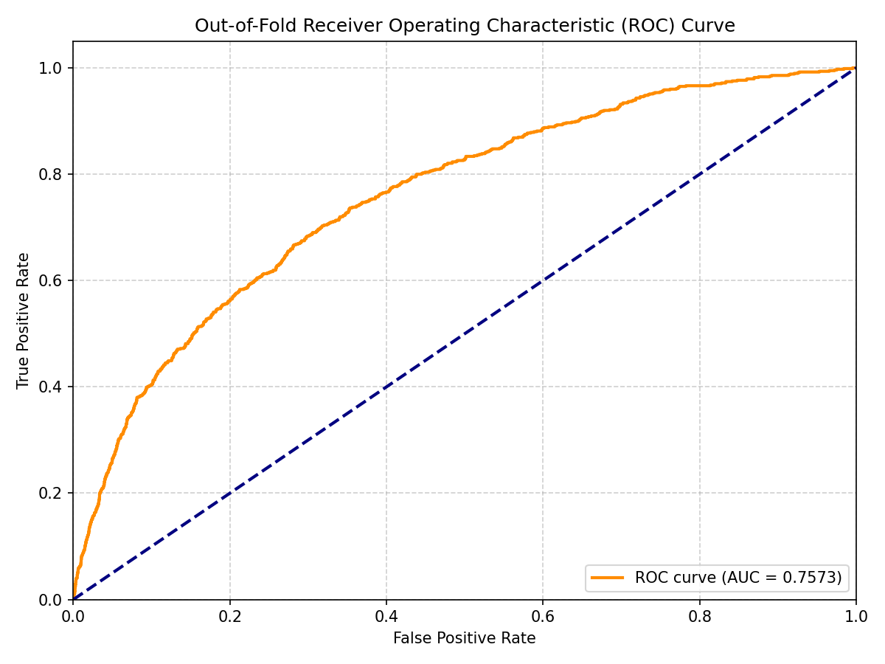
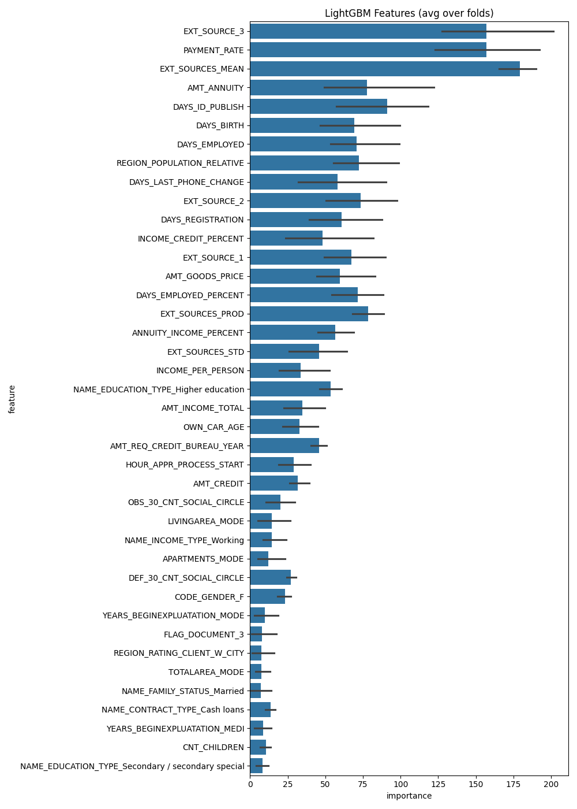

# Dự án Học máy - Dự đoán Rủi ro Vỡ nợ Tín dụng (Home Credit Default Risk)

Mục tiêu của dự án là xây dựng một pipeline học máy có khả năng dự đoán liệu người vay có **vỡ nợ** hoặc **gặp khó khăn trong việc thanh toán khoản vay** hay không. Nhiều cá nhân, đặc biệt là những người có ít hoặc không có lịch sử tín dụng, thường gặp khó khăn khi tiếp cận các khoản vay. Home Credit Group sử dụng các nguồn dữ liệu thay thế (như dữ liệu viễn thông và giao dịch) để đánh giá tốt hơn khả năng trả nợ của khách hàng.

**Những thách thức chính:**
- Xử lý bộ dữ liệu **mất cân bằng nghiêm trọng**, khi số trường hợp vỡ nợ chỉ chiếm khoảng **~8%** tổng số đơn vay
- Xử lý và tổng hợp dữ liệu từ **nhiều bảng quan hệ** khác nhau (`bureau`, `previous_application`, `installments_payments`)
- Tối ưu hóa **bộ nhớ sử dụng** khi xử lý tập dữ liệu lớn (có thể lên tới vài GB)
---
## Dataset
 
| Thông tin | Chi tiết |
|-----------|---------|
| Nguồn | [Kaggle - Home Credit Default Risk](https://www.kaggle.com/c/home-credit-default-risk) |
| File chính | application_train.csv |
| Số dòng | 307.511 đơn vay |
| Số features gốc | 122 features |
| Tỉ lệ default | ~8.07% (imbalanced) |
| Bảng phụ | bureau, previous_application, installments_payments |

> Dữ liệu không được đính kèm trong repo do dung lượng lớn.  
> Tải về từ Kaggle và đặt vào thư mục `data/`.
## Step 1: nhập thư viện cần thiết 

Chúng ta bắt đầu bằng cách nhập các thư viện xử lý dữ liệu, trực quan hóa và mô hình hóa cần thiết:

```python
import os
import gc
import numpy as np
import pandas as pd
import lightgbm as lgb
from sklearn.model_selection import StratifiedKFold
from sklearn.metrics import roc_auc_score
import matplotlib.pyplot as plt
import seaborn as sns
```

---

## Step 2: Làm sạch và Tổng hợp Dữ liệu (Data Cleaning & Aggregation)

### 1. Tải và làm sạch dữ liệu

Tải tập train/test và xử lý các giá trị bất thường. Ví dụ, trong `DAYS_EMPLOYED`, giá trị `365243` (tương đương ~1000 năm làm việc) là một anomaly và được thay bằng `NaN`:

```python
train_path = 'data/application_train.csv'
test_path = 'data/application_test.csv'
df = pd.read_csv(train_path)
test_df = pd.read_csv(test_path)

# Gộp tập train và test để xử lý đồng nhất
df = pd.concat([df, test_df], ignore_index=True)

# Thay thế giá trị bất thường trong DAYS_EMPLOYED
df['DAYS_EMPLOYED'] = df['DAYS_EMPLOYED'].replace(365243, np.nan)
```

### 2. Tổng hợp dữ liệu từ các bảng liên quan (Bureau Data)

Để khai thác lịch sử tín dụng của khách hàng, ta nhóm và tổng hợp dữ liệu từ bảng `bureau` (CIC History) theo từng khách hàng:

```python
# Tổng hợp thông tin bureau theo SK_ID_CURR
bureau_agg = bureau.groupby('SK_ID_CURR').agg({
    'DAYS_CREDIT': ['min', 'max', 'mean', 'var'],
    'DAYS_CREDIT_ENDDATE': ['min', 'max', 'mean'],
    'AMT_CREDIT_SUM': ['max', 'mean', 'sum'],
    'AMT_CREDIT_SUM_DEBT': ['max', 'mean', 'sum']
})
bureau_agg.columns = pd.Index(["BUREAU_" + e[0] + "_" + e[1].upper() for e in bureau_agg.columns.tolist()])

# Gộp vào bảng chính
df = df.join(bureau_agg, how='left', on='SK_ID_CURR')
```

### 3. Previous Applications
```python
# Aggregate past applications with Home Credit
prev_agg = prev.groupby('SK_ID_CURR').agg({
    'AMT_ANNUITY': ['min', 'max', 'mean'],
    'AMT_APPLICATION': ['min', 'max', 'mean'],
    'DAYS_DECISION': ['min', 'max', 'mean'],
    'CNT_PAYMENT': ['mean', 'sum']
})
prev_agg.columns = pd.Index(["PREV_" + e[0] + "_" + e[1].upper() for e in prev_agg.columns.tolist()])
df = df.join(prev_agg, how='left', on='SK_ID_CURR')
```


## 📊 Kết quả Tiền xử lý & Gộp dữ liệu (Data Cleaning & Preprocessing)

**Quy trình xử lý dữ liệu:**

| Bước | Bảng dữ liệu | Kích thước sau xử lý | Bộ nhớ giảm |
|------|-------------|----------------------|-------------|
| 1 | Application Train/Test | (10,000, 122) / (10,000, 121) | 10.2% |
| 2 | Bureau & Bureau Balance | (2,011, 55) | 50.4% |
| 3 | Previous Applications | (9,734, 186) | 50.4% |
| 4 | Installment Payments | (8,893, 26) | 50.9% |
| **Cuối cùng** | **Dataset đã gộp** | **(20,000, 534)** | — |

**Nhận xét:**
- Dữ liệu gốc gồm **nhiều bảng riêng biệt** (application, bureau, previous applications, installments) 
→ cần gộp lại (merge) thành 1 bảng duy nhất để đưa vào mô hình
- Số cột tăng vượt bậc từ **122 → 534** sau khi gộp 
→ mỗi khách hàng được bổ sung thêm thông tin lịch sử tín dụng, đơn vay trước đó, lịch sử thanh toán
- Tối ưu kiểu dữ liệu (downcast) giúp **giảm 10–50% bộ nhớ** sử dụng, tăng tốc xử lý và huấn luyện mô hình

> 💡 **Lưu ý:** Số cột tăng mạnh (534 cột) cho thấy việc **Feature Engineering** từ nhiều nguồn dữ liệu khác nhau là bước quan trọng nhất trong dự án này, ảnh hưởng trực tiếp đến chất lượng dự đoán của mô hình.
---


## Step 3: Domain-Specific Feature Engineering

We design key financial and demographic ratios from the application data:

```python
# Create custom credit scoring ratios
df['DAYS_EMPLOYED_PERCENT'] = df['DAYS_EMPLOYED'] / df['DAYS_BIRTH']
df['INCOME_CREDIT_PERCENT'] = df['AMT_INCOME_TOTAL'] / df['AMT_CREDIT']
df['INCOME_PER_PERSON'] = df['AMT_INCOME_TOTAL'] / df['CNT_FAM_MEMBERS']
df['ANNUITY_INCOME_PERCENT'] = df['AMT_ANNUITY'] / df['AMT_INCOME_TOTAL']
df['PAYMENT_RATE'] = df['AMT_ANNUITY'] / df['AMT_CREDIT']

# Aggregate external scoring sources
ext_sources = ['EXT_SOURCE_1', 'EXT_SOURCE_2', 'EXT_SOURCE_3']
df['EXT_SOURCES_PROD'] = df[ext_sources].prod(axis=1)
df['EXT_SOURCES_STD'] = df[ext_sources].std(axis=1)
df['EXT_SOURCES_STD'] = df['EXT_SOURCES_STD'].fillna(df['EXT_SOURCES_STD'].mean())
```
## Giải thích các features quan trọng

### EXT_SOURCE_1, EXT_SOURCE_2, EXT_SOURCE_3
Đây là **điểm tín dụng từ nguồn bên ngoài** (External Credit Score) — được cung cấp bởi các tổ chức đánh giá tín dụng độc lập bên ngoài Home Credit. Giá trị nằm trong khoảng **0 đến 1**, càng cao càng ít rủi ro.

- `EXT_SOURCE_1` — điểm từ nguồn tín dụng thứ nhất
- `EXT_SOURCE_2` — điểm từ nguồn tín dụng thứ hai  
- `EXT_SOURCE_3` — điểm từ nguồn tín dụng thứ ba

> Đây là nhóm features **quan trọng nhất** trong model — feature importance của LightGBM cho thấy cả 3 đều nằm trong top 5, với EXT_SOURCE_2 và EXT_SOURCE_3 đứng đầu.

### Các features tự tạo (Feature Engineering)
| Feature | Công thức | Ý nghĩa |
|---------|-----------|---------|
| `CREDIT_INCOME_RATIO` | AMT_CREDIT / AMT_INCOME_TOTAL | Tỉ lệ khoản vay so với thu nhập — càng cao càng rủi ro |
| `DAYS_EMPLOYED_PERCENT` | DAYS_EMPLOYED / DAYS_BIRTH | Tỉ lệ thời gian đi làm so với tuổi đời |
| `ANNUITY_INCOME_PERCENT` | AMT_ANNUITY / AMT_INCOME_TOTAL | Tỉ lệ trả góp hàng năm so với thu nhập |
| `PAYMENT_RATE` | AMT_ANNUITY / AMT_CREDIT | Tỉ lệ thanh toán hàng kỳ |
| `EXT_SOURCES_MEAN` | Mean(EXT_SOURCE_1/2/3) | Điểm tín dụng trung bình từ 3 nguồn |
---


## Step 4: Xây dựng và Huấn luyện Mô hình (Building and Training the Model)

Triển khai vòng lặp **Stratified 5-Fold Cross-Validation** và huấn luyện mô hình **LightGBM Classifier** với các siêu tham số đã được tối ưu cho dữ liệu tín dụng dạng bảng:

```python
folds = StratifiedKFold(n_splits=5, shuffle=True, random_state=42)
oof_preds = np.zeros(train_df.shape[0])
sub_preds = np.zeros(test_df.shape[0])
features = [col for col in train_df.columns if col not in ['TARGET', 'SK_ID_CURR']]

for fold_, (trn_idx, val_idx) in enumerate(folds.split(X, y)):
    X_train, y_train = X.iloc[trn_idx], y[trn_idx]
    X_val, y_val = X.iloc[val_idx], y[val_idx]
    
    clf = lgb.LGBMClassifier(
        objective='binary',
        metric='auc',
        n_estimators=10000,
        learning_rate=0.02,
        num_leaves=34,
        max_depth=8,
        subsample=0.87156,
        colsample_bytree=0.949703,
        reg_alpha=0.0415454,
        reg_lambda=0.0735294,
        n_jobs=-1,
        verbosity=-1
    )
    
    # Huấn luyện mô hình với early stopping
    clf.fit(
        X_train, y_train,
        eval_set=[(X_train, y_train), (X_val, y_val)],
        eval_names=['train', 'valid'],
        callbacks=[lgb.early_stopping(200, verbose=False), lgb.log_evaluation(200)]
    )
    
    oof_preds[val_idx] = clf.predict_proba(X_val, num_iteration=clf.best_iteration_)[:, 1]
    sub_preds += clf.predict_proba(X_test, num_iteration=clf.best_iteration_)[:, 1] / folds.n_splits
```

**Kết quả từng Fold:**

| Fold | Train AUC | Validation AUC |
|------|-----------|-----------------|
| 1 | 0.8888 | 0.7567 |
| 2 | 0.8417 | 0.7724 |
| 3 | 0.8834 | 0.7652 |
| 4 | 0.8476 | 0.7431 |
| 5 | 0.8462 | 0.7548 |

**🎯 Overall Out-of-Fold ROC-AUC:** `0.7573`
---


## Step 5: Đánh giá Mô hình (Evaluate the Model)

Chỉ số đánh giá chính là **Area Under the ROC Curve (ROC-AUC)**. Sau khi cross-validation, đánh giá điểm số tổng thể trên tập out-of-fold:

```python
overall_auc = roc_auc_score(y, oof_preds)
print(f"Overall Out-of-Fold ROC-AUC: {overall_auc:.6f}")
```
**📊 Nhận xét kết quả huấn luyện:**

- Validation AUC dao động trong khoảng **0.7431 – 0.7724**, không có fold nào lệch bất thường → mô hình **ổn định** và **tổng quát hóa tốt** trên các tập dữ liệu khác nhau
- Train AUC (**0.8417 – 0.8888**) cao hơn rõ rệt so với Validation AUC → cho thấy mô hình có dấu hiệu **overfitting nhẹ**, học khá tốt trên tập train nhưng giảm hiệu suất khi gặp dữ liệu mới
- **Fold 2** đạt Validation AUC cao nhất (**0.7724**) trong khi Train AUC lại thấp nhất (**0.8417**) → đây là fold có sự cân bằng tốt nhất giữa học và tổng quát hóa
- **Fold 4** có Validation AUC thấp nhất (**0.7431**) → có thể do phân bố dữ liệu ở fold này khó dự đoán hơn hoặc chứa nhiều trường hợp biên (edge cases)

> 💡 **Kết luận:** Với AUC trung bình khoảng **~0.76**, mô hình có khả năng phân biệt khá tốt giữa khách hàng có nguy cơ vỡ nợ và không vỡ nợ (AUC = 0.5 là đoán ngẫu nhiên, AUC = 1.0 là hoàn hảo). Tuy nhiên, vẫn còn không gian để cải thiện thông qua **feature engineering** sâu hơn hoặc **tinh chỉnh siêu tham số (hyperparameter tuning)**.
Đồng thời trực quan hóa mức độ quan trọng của các đặc trưng (feature importance) để hiểu yếu tố nào ảnh hưởng nhiều nhất đến dự đoán khả năng vỡ nợ:

```python
# Tạo dataframe chứa độ quan trọng của đặc trưng
importance_df = pd.DataFrame()
importance_df["feature"] = features
importance_df["importance"] = clf.feature_importances_

# Vẽ top 40 đặc trưng quan trọng nhất
cols = importance_df.groupby("feature").mean().sort_values(by="importance", ascending=False)[:40].index
sns.barplot(x="importance", y="feature", data=importance_df[importance_df.feature.isin(cols)])
plt.title('LightGBM Features (avg over folds)')
plt.show()
```

## Step 6: Kết quả xác định Feature Importance và Nhận xét
Sau khi huấn luyện mô hình qua cross-validation, ta tính độ quan trọng trung bình của từng đặc trưng (feature importance) trên tất cả các fold, nhằm xác định những yếu tố ảnh hưởng nhiều nhất đến khả năng dự đoán rủi ro vỡ nợ của mô hình.



### 📊 Nhận xét Feature Importance:
- Ba đặc trưng dẫn đầu — **EXT_SOURCES_MEAN, EXT_SOURCE_3, PAYMENT_RATE** — có độ quan trọng vượt xa và khá ngang nhau (khoảng 150–200), tạo thành một nhóm "top tier" riêng biệt so với phần còn lại. Điều này cho thấy phần lớn khả năng dự đoán của mô hình tập trung chủ yếu vào nhóm 3 feature này.

- **EXT_SOURCES_MEAN** (giá trị trung bình của 3 điểm tín dụng ngoài) có độ quan trọng cao nhất, cao hơn cả từng EXT_SOURCE riêng lẻ. Điều này cho thấy việc **tổng hợp (aggregate)** nhiều nguồn điểm tín dụng bên ngoài mang lại tín hiệu dự báo ổn định và mạnh hơn so với dùng từng điểm số riêng lẻ.

- Sau top 3, có một khoảng cách rõ rệt (importance giảm từ ~150-200 xuống còn ~50-80) trước khi chuyển sang nhóm feature tầm trung gồm **AMT_ANNUITY, DAYS_ID_PUBLISH, DAYS_BIRTH, DAYS_EMPLOYED, REGION_POPULATION_RELATIVE, EXT_SOURCE_1, EXT_SOURCE_2, DAYS_EMPLOYED_PERCENT, EXT_SOURCES_PROD** — đa phần là các đặc trưng nhân khẩu học, thời gian và các biến được tổng hợp từ điểm tín dụng ngoài.

- Các biến phân loại dạng one-hot (**NAME_EDUCATION_TYPE, NAME_FAMILY_STATUS_Married, CODE_GENDER_F, FLAG_DOCUMENT_3, NAME_CONTRACT_TYPE_Cash loans, CNT_CHILDREN**) đều có importance rất thấp (dưới 20), cho thấy từng nhãn phân loại riêng lẻ mang ít giá trị phân biệt rủi ro hơn nhiều so với các đặc trưng số liên tục hoặc được tổng hợp.

- Thanh lỗi (error bar) ở nhóm top 3 và một số feature như **DAYS_ID_PUBLISH** khá rộng, cho thấy có sự dao động về mức độ quan trọng giữa các fold, tuy nhiên các feature này vẫn nhất quán giữ vị trí dẫn đầu qua các fold.

- Tổng thể, mô hình phụ thuộc mạnh vào nhóm điểm tín dụng ngoài (EXT_SOURCE) và khả năng chi trả (PAYMENT_RATE), trong khi các đặc trưng phân loại nhân khẩu học gốc chỉ đóng vai trò bổ trợ, đóng góp tương đối nhỏ vào quyết định của mô hình.

## Step 7:Kết quả Submission 

Bảng dưới đây hiển thị 20 dòng đầu trong file kết quả dự đoán (tổng cộng khoảng 48.744 dòng, đúng bằng kích thước test set của cuộc thi Home Credit Default Risk).

| SK_ID_CURR | TARGET (xác suất) |
|------------|--------------------|
| 100001     | 0.0275             |
| 100005     | 0.1321             |
| 100013     | 0.0315             |
| 100028     | 0.0427             |
| 100038     | 0.1771             |
| 100042     | 0.0426             |
| 100057     | 0.0045             |
| 100065     | 0.0273             |
| 100066     | 0.0128             |
| 100067     | 0.1145             |
| 100074     | 0.0697             |
| 100090     | 0.0285             |
| 100091     | 0.1549             |
| 100092     | 0.0622             |
| 100106     | 0.0555             |
| 100107     | 0.1840             |
| 100109     | 0.0582             |
| 100117     | 0.0241             |
| 100128     | 0.1058             |
| 100141     | 0.0283             |

*Toàn bộ kết quả đầy đủ nằm trong file [`submission.csv`](./submission.csv).*

---

## 🏃 Getting Started & How to Run

1. Clone the repository and install required packages:
   ```bash
   pip install -r requirements.txt
   ```
2. Put the Kaggle dataset files inside the `data/` directory.
3. Run the entire pipeline:
   ```bash
   python run.py --mode all
   ```
4. Find the training log output, saved LightGBM models, and the feature importance plots in the `models/` directory. The final test predictions will be saved as `submission.csv`.
